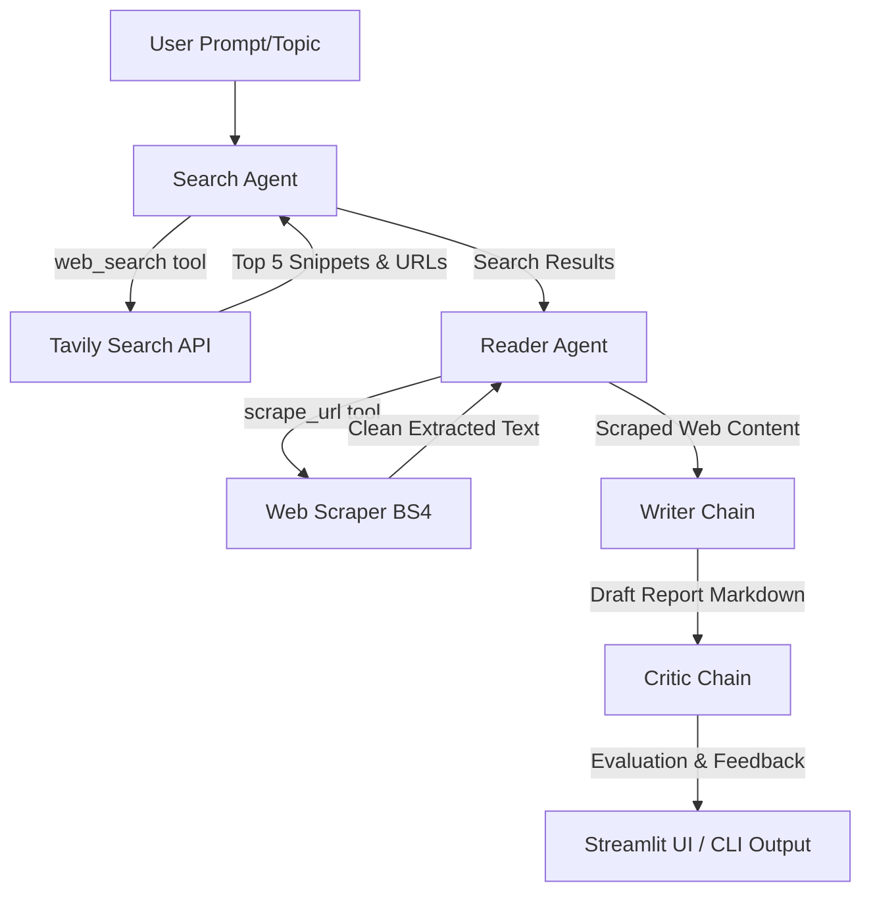

# Multi-Agent Research System

An automated, cooperative multi-agent research pipeline designed to search the web, scrape relevant resources, synthesize structured reports, and evaluate outputs using LLMs and agentic workflows.

---

## 1. Problem Statement
Manual research is inefficient and fragmented. It requires querying search engines, browsing multiple URLs, filtering out extraneous advertisements/scripts, synthesizing information into a coherent report, and critically reviewing the text for omissions and factual consistency. 

This project solves this by orchestrating specialized AI agents and LLM chains into a synchronous, automated pipeline to execute these steps sequentially and present a polished, peer-reviewed markdown report.

---

## 2. Tech Stack
- **Language**: Python 3.8+
- **Agent Orchestration**: [LangChain](https://github.com/langchain-ai/langchain) / LangChain Core / LangChain Community
- **LLM Provider**: Azure OpenAI Service via [langchain-openai](file:///home/krishna/internship%20projects/Multi-agent-research-system/requirements.txt) (enterprise-grade low latency, high context windows)
- **Web Search**: [Tavily Search API](https://tavily.com/)
- **Scraping & Parsing**: BeautifulSoup4 (BS4), Requests, LXML
- **Web UI**: Streamlit (featuring a custom glassmorphic dark-theme UI with progress state tracking)
- **Environment Management**: Python-dotenv

---

## 3. Solution Architecture
The system consists of two autonomous, tool-using agents and two structured LLM chains cooperating in a pipeline.



### Core Components
1. **Search Agent**: Built using [build_search_agent()](file:///home/krishna/internship%20projects/Multi-agent-research-system/agents.py#L15) with the custom [web_search](file:///home/krishna/internship%20projects/Multi-agent-research-system/tools.py#L12) tool to gather structured snippets and URLs.
2. **Reader Agent**: Built using [build_reader_agent()](file:///home/krishna/internship%20projects/Multi-agent-research-system/agents.py#L23) with the custom [scrape_url](file:///home/krishna/internship%20projects/Multi-agent-research-system/tools.py#L26) tool to extract readable text (excluding `<script>`, `<style>`, `<nav>`, `<footer/>` tags) limited to 3000 characters.
3. **Writer Chain**: Defined as [writer_chain](file:///home/krishna/internship%20projects/Multi-agent-research-system/agents.py#L50). It compiles combined search results and scraped content into a professional, structured markdown document.
4. **Critic Chain**: Defined as [critic_chain](file:///home/krishna/internship%20projects/Multi-agent-research-system/agents.py#L77). It evaluates the generated report on a scale of 0-10, highlights strengths, details areas to improve, and provides a final verdict.

---

## 4. Input & Output

### Input
- **API Keys & Endpoints**:
  - `AZURE_OPENAI_API_KEY`: Azure OpenAI subscription key.
  - `AZURE_OPENAI_ENDPOINT`: Endpoint URL (e.g. `https://<your-resource>.openai.azure.com/`).
  - `AZURE_OPENAI_DEPLOYMENT_NAME`: The name of your Azure deployment (e.g. `gpt-4o`).
  - `AZURE_OPENAI_API_VERSION`: API version to target (e.g. `2024-08-01-preview`).
  - `TAVILY_API_KEY`: For web search execution.
- **User Query**: A research topic string (e.g., `"CRISPR gene editing breakthroughs"`).

### Output
- **Raw Web Results**: Search snippets and scraped raw text from target websites.
- **Final Research Report**: Rendered markdown containing:
  - Introduction
  - Key Findings (at least 3 detailed sections)
  - Conclusion
  - Linked Sources (validated URLs)
- **Critic Report**: Quality assessment showing numerical score, strengths, and critique points.

---

## 5. Workflow Execution
The pipeline ([run_research_pipeline](file:///home/krishna/internship%20projects/Multi-agent-research-system/pipeline.py#L3)) operates as follows:

1. **Query & Search**: The **Search Agent** executes `web_search` and outputs a collection of relevant URLs and text snippets.
2. **Scraping**: The **Reader Agent** reviews the search payload, chooses the single most promising URL, fetches it via `scrape_url`, and formats clean textual context.
3. **Synthesis**: The **Writer Chain** accepts the raw search query, snippets, and scraped content, then synthesizes a markdown draft.
4. **Critique**: The **Critic Chain** parses the drafted markdown, checks for issues, and issues an evaluation summary.

---

## 6. Setup Guide

### Prerequisites
- Python 3.8 or higher installed on your system.

### Installation Steps

1. **Clone & Navigate to Project Directory**:
   ```bash
   cd "/home/krishna/internship projects/Multi-agent-research-system"
   ```

2. **Initialize and Activate Virtual Environment**:
   ```bash
   python -m venv venv
   source venv/bin/activate
   ```

3. **Install Dependencies**:
   ```bash
   pip install -r requirements.txt
   ```

4. **Configure Environment Variables**:
 
   TAVILY_API_KEY=your_tavily_api_key_here

   # Azure OpenAI Configuration
   AZURE_OPENAI_API_KEY=your_azure_openai_key_here
   AZURE_OPENAI_ENDPOINT=https://your-resource-name.openai.azure.com/
   AZURE_OPENAI_DEPLOYMENT_NAME=your_deployment_name_here
   AZURE_OPENAI_API_VERSION=2024-08-01-preview
   ```

### Running the Application

- **CLI Mode**: Run the pipeline directly in your terminal:
  ```bash
  python pipeline.py
  ```
  *(Enter the topic when prompted by [pipeline.py](file:///home/krishna/internship%20projects/Multi-agent-research-system/pipeline.py#L72-L75))*

- **Web UI Mode**: Launch the Streamlit application for an interactive dashboard:
  ```bash
  streamlit run app.py
  ```
  *(Access the frontend in your browser at `http://localhost:8501` to use [app.py](file:///home/krishna/internship%20projects/Multi-agent-research-system/app.py))*
